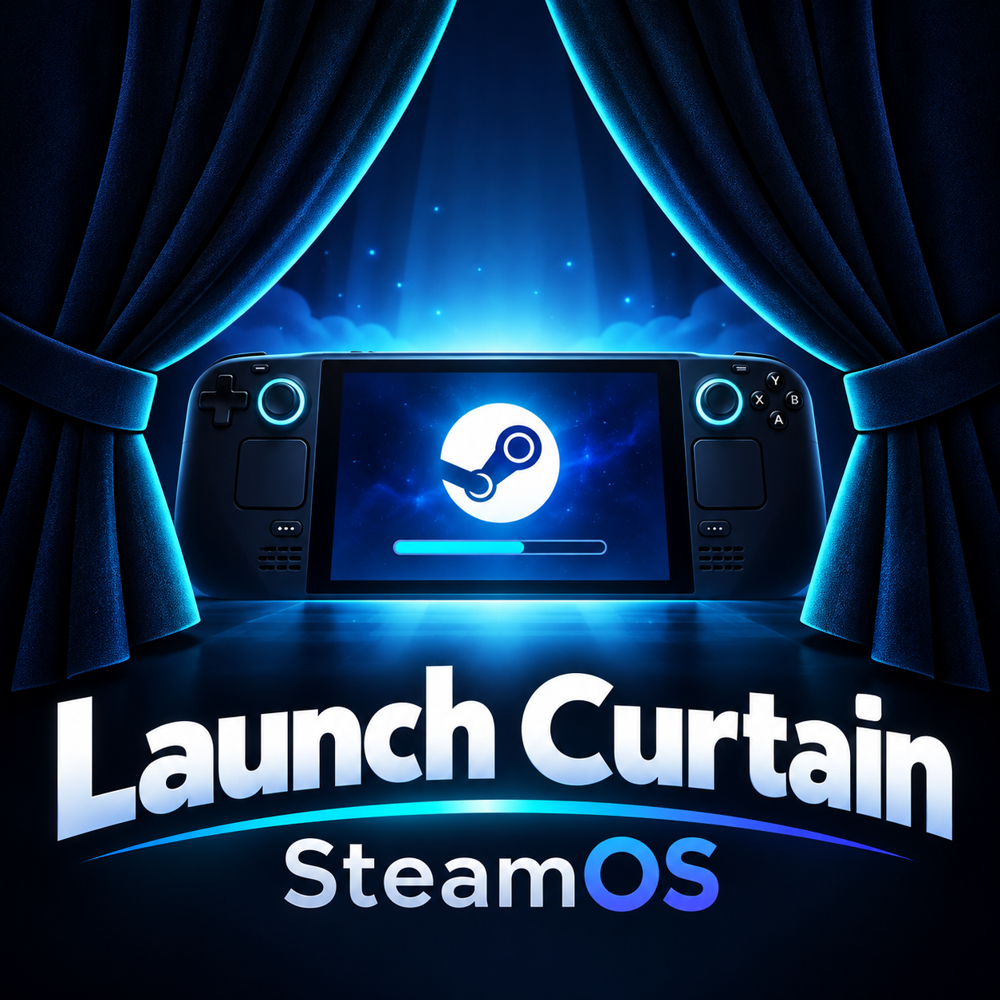

# Launch Curtain SteamOS



**Launch Curtain SteamOS** is a native SteamOS / Decky adaptation of the Launch Curtain concept.  
The plugin displays a custom loading curtain when launching a game from Steam Game Mode, creating a smoother visual transition between the Steam UI and the game itself.

> **Note:** This version was built specifically for SteamOS and does not depend on Windows components such as PowerShell, `user32`, `kernel32`, or `.exe` process monitoring.

---

## Features

- Native **SteamOS** support
- Full **Decky Loader plugin** integration
- Automatic curtain when launching a Steam game
- Manual **“Test Curtain”** button
- Displays the real game title for regular Steam games
- Automatic Steam artwork detection
- Support for Steam's local `appcache/librarycache`
- Support for custom Steam artwork from the user profile
- Steam CDN fallback when no local artwork is available
- Game logo display when available
- Hero / background artwork support
- Optional custom background image
- Adjustable background opacity
- Adjustable logo size
- Adjustable timeout
- Adjustable fade-out delay
- Subtle background animation
- Curtain can be closed with **B / Back** or **Escape**
- Native SteamOS implementation without Windows-specific components

---

## Installation

### Requirements

- SteamOS
- **Decky Loader** installed
- Decky Developer Mode enabled

### Install from ZIP

1. Download the latest release ZIP from GitHub.
2. Open **Decky Loader** in Steam.
3. Go to **Decky Settings**.
4. Enable **Developer Mode** if required.
5. Choose **“Install Plugin from ZIP File”**.
6. Select the downloaded Launch Curtain SteamOS ZIP.
7. Wait for Decky to finish installing the plugin.
8. Fully exit Steam via **Steam → Exit**.
9. Start Steam again.

> A full Steam restart is recommended because Steam and Decky may cache frontend plugin files.

---

## Usage

After installation, **Launch Curtain SteamOS** will appear in the Decky menu.

The plugin settings allow you to customize the look and behavior of the curtain.

Use **“Test Curtain”** to verify that the curtain renders correctly.

When launching a regular Steam game, the curtain will appear automatically.

---

## Artwork Detection

For regular Steam games, Launch Curtain SteamOS attempts to resolve artwork in several steps:

1. User-provided custom Steam artwork
2. Local Steam `librarycache`
3. Steam CDN fallback
4. If no logo is available: display the real game title

This makes the plugin compatible with games that no longer use Steam's older fixed `logo.png` asset layout.

---

## Non-Steam Games

Non-Steam games are **not fully supported yet**.

Steam assigns shortcut-specific or effectively random App IDs to Non-Steam shortcuts.  
Mapping those IDs back to the actual shortcut name is not yet reliable on every system in the current version.

As a result, a Non-Steam title may currently appear as:

```text
Steam App 3827xxxxxx
```

instead of the actual shortcut name.

Because of this, automatic logo and artwork lookup for Non-Steam games is also currently limited.

**Regular Steam games are not affected by this limitation.**

Improved Non-Steam game detection is planned for a future release.

---

## Known Limitations

- Non-Steam games are not yet reliably resolved by shortcut name.
- Artwork for Non-Steam titles may therefore be missing.
- Custom background image support is implemented but may require additional testing depending on the SteamOS / Decky version.
- A full Steam restart may be required after plugin updates.

---

## Origin

Launch Curtain SteamOS is based on the idea of the original **Launch Curtain** project by **LoZazaMastro**, but has been reworked for SteamOS.

The SteamOS version does not use Windows-specific components and instead relies on Steam / Decky frontend interfaces and the local Steam artwork cache.

Original project:

https://github.com/LoZazaMastro/Launch-Curtain

---

## Status

The plugin is currently under active development.

Feedback, bug reports, and improvement suggestions are welcome.

---

## License

Please respect the license of the original Launch Curtain project as well as the license used by this repository.
